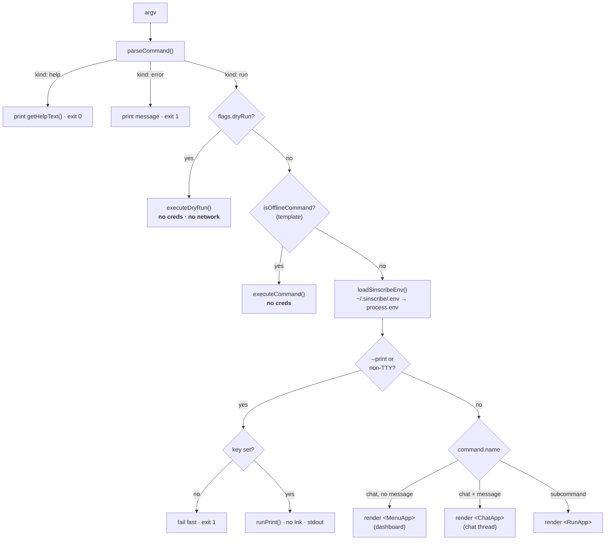
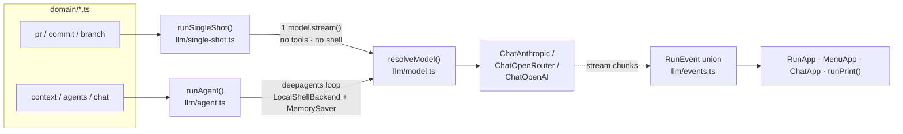
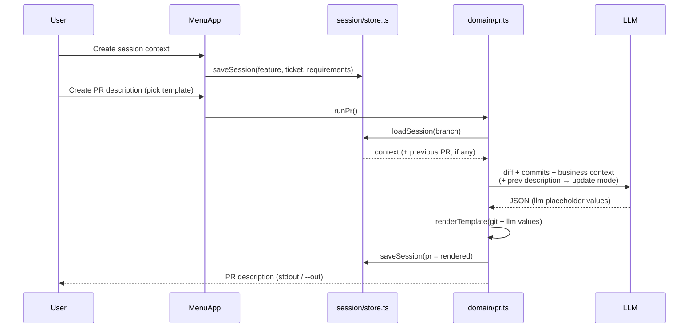

# Sinscribe — Developer & Maintainer Documentation

This document is for people **building on or maintaining** Sinscribe, a
git-centric developer-workflow assistant CLI. For what it does and how to use
it, read `README.md` — that pitch is not repeated here.

Which doc to read:

| Doc                | Job                                                                   |
| ------------------ | --------------------------------------------------------------------- |
| `README.md`        | User-facing: install, config, commands, templates, sessions           |
| `documentation.md` | This file: maintainer reference — layers, flows, conventions, recipes |
| `CONTRIBUTING.md`  | Contributor quick-start: setup, gates, house rules                    |
| `DESIGN.md`        | Sinscribe's own design decisions (live "Open decisions" list)         |

> **Heritage.** Sinscribe was inspired by
> [openwiki](https://github.com/langchain-ai/openwiki) and started from its
> agentic-CLI skeleton (provider registry, config/secrets layer, Ink UI shell,
> streaming-event normalization, deepagents loop). The domain — git workflows,
> templates, sessions — is Sinscribe's own.

---

## 1. What it does (command surface)

| Command                       | LLM mode             | Reads                                                                    | Produces                                                     |
| ----------------------------- | -------------------- | ------------------------------------------------------------------------ | ------------------------------------------------------------ |
| `sinscribe` (bare)            | agentic / none       | current repo                                                             | Interactive **menu** dashboard (or chat if given a message)  |
| `sinscribe pr`                | single-shot          | `git diff <base>...HEAD` + commits + branch + session context + template | Filled PR/MR description (stdout or `--out`)                 |
| `sinscribe prompt <input>`    | single-shot          | branch/ticket context + your description                                 | Copy-ready feature/bugfix task prompt for an AI coding agent |
| `sinscribe commit`            | single-shot          | `git diff --staged` (or `--all`)                                         | Conventional Commit + Gitmoji message                        |
| `sinscribe branch <input>`    | single-shot (tiny)   | ticket ID and/or free text                                               | Up to 3 `type/TICKET-slug` suggestions                       |
| `sinscribe context`           | agentic (deepagents) | repo exploration                                                         | Structured project-context brief (md or json)                |
| `sinscribe docs`              | agentic (deepagents) | repo exploration                                                         | Project documentation with mermaid diagrams                  |
| `sinscribe agents`            | agentic (deepagents) | repo exploration                                                         | Creates/updates `CLAUDE.md` / `AGENTS.md`                    |
| `sinscribe template <action>` | none                 | template library on disk                                                 | list / show / add / edit / path                              |

Global flags on every command: `--dry-run` (deterministic scaffold, **no LLM,
no credentials**), `-p/--print` (one-shot to stdout; also the default when
stdin is not a TTY), `--model-id <id>` (per-run override), `-h/--help`.

---

## 2. Tech stack

- **Language:** TypeScript 5.7, `strict`, `module: NodeNext`, `target: ES2022`,
  ESM only (`"type": "module"`). Source in `src/`, compiled to `dist/`.
- **Runtime:** Node ≥ 20. Ships one binary: `sinscribe` → `dist/cli.js`.
- **TUI:** React 18 + [Ink](https://github.com/vadimdemedes/ink) 5 (`jsx: react-jsx`).
- **LLM:** LangChain v1 — `@langchain/anthropic`, `@langchain/openai`,
  `@langchain/openrouter`, `@langchain/core`, `@langchain/langgraph`
  (`MemorySaver`), and `deepagents` (`createDeepAgent`, `LocalShellBackend`).
- **Parsing:** `yaml` for template frontmatter. Everything else is hand-rolled
  (argv parser, `.env` parser) — no arg-parsing library.
- **Tooling:** `tsc` (build), `vitest` (test), `eslint` flat config + `typescript-eslint`
  (lint), `prettier` (format), `tsx` (run from source), `pnpm`.

---

## 3. Repository layout

```
sinscribe/
├── package.json            # scripts, deps, bin wiring, npm "files" allowlist
├── tsconfig.json           # strict, NodeNext, rootDir src → outDir dist
├── eslint.config.js        # flat config (type-checked rules for src/ and test/)
├── .github/workflows/ci.yml # CI: build + test + lint + format on push/PR
├── LICENSE                 # MIT
├── README.md               # user-facing intro
├── DESIGN.md               # the design (command surface, template schema, decisions)
├── CONTRIBUTING.md         # contributor quick-start
├── documentation.md        # this file
│
├── templates/              # SHIPPED PR templates (built-in tier)
│   ├── andersoftware.md    #   default: Conventional Commits + Gitmoji + review sections
│   ├── github.md  google.md  kubernetes.md  shopify.md  stripe.md
│
├── src/
│   ├── cli.tsx             # ENTRY: shebang, main() routing, no-Ink print path
│   ├── commands.ts         # argv → CliCommand union; getHelpText()
│   ├── constants.ts        # provider registry, env-key names, model presets, validators
│   ├── env.ts              # ~/.sinscribe/.env load/save, perms, redacted diagnostics
│   ├── credentials.tsx     # first-run API-key wizard (Ink)
│   │
│   ├── domain/             # one module per command + the dispatcher
│   │   ├── execute.ts      #   executeCommand / executeDryRun / command classifiers
│   │   ├── pr.ts  prompt.ts  commit.ts  branch.ts  context.ts  docs.ts  agents.ts  template.ts
│   │   ├── prompts.ts      #   system-prompt builders for every command
│   │   └── errors.ts       #   CliError (clean, user-facing failures)
│   │
│   ├── git/                # everything that shells out to git
│   │   ├── run.ts          #   runGit (never-throw) / tryGit (null on failure)
│   │   ├── repo.ts         #   repo detection, branch, base-ref resolution
│   │   ├── diff.ts         #   staged/worktree/range diffs + size capping
│   │   └── ticket.ts       #   ticket parsing, slugify, branch-type inference, name building
│   │
│   ├── llm/                # the model layer (the two-tier runner)
│   │   ├── model.ts        #   resolveModel(): env → provider → model instance
│   │   ├── single-shot.ts  #   runSingleShot() + extractJsonObject() — pr/commit/branch/prompt
│   │   ├── agent.ts        #   runAgent() deepagents loop — context/docs/agents/chat
│   │   └── events.ts       #   RunEvent union + content-text extraction
│   │
│   ├── templates/          # the template engine
│   │   ├── schema.ts       #   parseTemplate(): frontmatter + typed placeholders
│   │   ├── registry.ts     #   3-tier discovery/override, save, scaffold
│   │   └── render.ts       #   renderTemplate(): {{slot}} substitution
│   │
│   ├── session/
│   │   └── store.ts        # .sinscribe/sessions/<branch>.json load/save
│   │
│   └── ui/                 # Ink layer: apps + presentation pieces
│       ├── run-app.tsx     #   RunApp — runs one subcommand, streams events
│       ├── menu-app.tsx    #   MenuApp — bare-`sinscribe` dashboard state machine
│       ├── chat-app.tsx    #   ChatApp — interactive chat thread
│       ├── run-view.tsx    #   Header, RunLog, appendEvent() event folding
│       ├── menu-view.tsx   #   MainMenu, SelectList, InlinePrompt
│       └── shared.ts       #   isDebugMode(), getErrorMessage()
│
└── test/                   # vitest suites (one file per covered module)
```

`.tmp/` holds local scratch artifacts and never ships. The npm package includes
only what the `files` allowlist in `package.json` names (`dist`, `templates`,
`README.md`).

---

## 4. How a command flows (end to end)

`src/cli.tsx` `main()` is the single decision tree. In order:

1. **Parse** — `parseCommand(process.argv.slice(2))` (`commands.ts`) returns a
   discriminated union: `{kind:"help"}`, `{kind:"error"}`, or `{kind:"run", command, flags}`.
2. **Help / error** — print and exit.
3. **Dry run** — if `flags.dryRun`, call `executeDryRun()` and exit. **This branch
   never loads credentials and never hits the network** — the guarantee is
   structural (it's a different code path, not a flag check inside the runner).
4. **Offline command** — `template` (`isOfflineCommand`) runs with no credentials.
5. **Load env** — `loadSinscribeEnv()` merges `~/.sinscribe/.env` into
   `process.env` _without_ overwriting existing process vars (process env wins).
6. **Non-interactive** — if `--print` or stdin is not a TTY: fail fast if no API
   key, else `runPrint()` (no Ink, result to stdout).
7. **Interactive routing:**
   - `chat` with no message → `<MenuApp>` (the dashboard).
   - `chat` with a message → `<ChatApp>` (a chat thread).
   - any subcommand → `<RunApp>` (runs once, streams, shows result).

Every runner ultimately calls `executeCommand()` (`domain/execute.ts`), which
dispatches on `command.name` to the matching `domain/*.ts` module. Those modules
gather git context, build a prompt (`domain/prompts.ts`), call the model
(`llm/single-shot.ts` or `llm/agent.ts`), and shape the result.

All three UIs and print mode consume the **same `RunEvent` stream** (`llm/events.ts`),
so behavior stays consistent across surfaces.

### 4.1 The `main()` routing tree



### 4.2 The two-tier runner (single-shot vs agentic)



The single-shot path stays pure on purpose: the CLI computes the diff locally, so
the model gets bounded, deterministic context and never touches the repo. The
agentic path exists only for the commands that must explore the repo themselves.

### 4.3 `pr` with sessions (context capture + update mode)



---

## 5. Layer-by-layer reference

### 5.1 Entry & CLI parsing

**`src/cli.tsx`** — the entry point; the only file that touches `process.argv`
and `render()`. It parses, routes (§4.1), and defines `runPrint()` — the no-Ink
one-shot path. The three Ink apps it renders live in `src/ui/`:

- `RunApp` (`ui/run-app.tsx`) — runs a single subcommand. Streams events into a
  `LogItem[]` log via `appendEvent`. Only _agentic_ commands stream live tool
  activity (`isAgenticCommand`); single-shot commands just show "Generating…"
  then the result.
- `MenuApp` (`ui/menu-app.tsx`) — the bare-`sinscribe` dashboard. A small state
  machine (`MenuView` union) drives screens: menu → session-input (3 steps) →
  template picker → running → result. It captures **business context** per
  branch and persists it via the session store, then feeds it into `pr`.
- `ChatApp` (`ui/chat-app.tsx`) — an interactive chat thread over the repo.
  Slash commands: `/exit`, `/quit`, `/clear` (starts a fresh thread id). Each
  turn shares one `threadId` so the agent has conversation memory (see
  `MemorySaver` in §5.3).

Credential setup is inlined: each app checks `needsCredentialSetup()` and renders
`<InitSetup>` first if the key is missing (TTY only).

**`src/commands.ts`** — a hand-rolled argv loop. Global flags are stripped first;
the first non-flag token selects the subcommand; per-command parsers
(`parsePr`, `parseCommit`, …) validate the rest and return either a `CommandSpec`
or an `{kind:"error"}`. Two important exported types:

- `GlobalFlags` = `{ dryRun, print, modelId }`.
- `CommandSpec` = discriminated union over `name` — this is the typed contract the
  whole domain layer switches on. Add a subcommand by extending this union, adding
  a parser, and adding a case in `execute.ts`.

`getHelpText()` is the single source of truth for `--help` output.

### 5.2 Domain layer (`src/domain/`)

One module per command, plus a dispatcher. Each command module exposes two
functions: `run<X>()` (the real run) and `dryRun<X>()` (deterministic scaffold).

- **`execute.ts`** — `executeCommand()` and `executeDryRun()` dispatch on
  `command.name`. Also the command classifiers used by the UI/entry:
  - `isAgenticCommand()` → `context | agents | chat` (streams tool activity).
  - `isOfflineCommand()` → `template` (no credentials/model ever).
- **`pr.ts`** — the richest command. `gatherPrContext()` ensures a repo, resolves
  the template, current branch, base ref, ticket (flag → branch name → session),
  and computes the range diff + log in parallel. It fills `from: git|branch`
  placeholders deterministically. `runPr()` builds the user prompt (branch, base,
  ticket, **business context**, and — in **update mode** — the previous
  description), calls `runSingleShot`, parses the JSON, renders the template, and
  **saves the result back into the session**. `--out` writes to a file.
- **`commit.ts`** — owns `GITMOJI_BY_TYPE` (the type→emoji map and, implicitly, the
  valid commit types: feat/fix/docs/style/refactor/perf/test/build/ci/chore/revert).
  Asks the model for `{type, scope, subject, body, breaking}`, then assembles the
  header `<gitmoji> type(scope)!: subject` with an optional body and
  `BREAKING CHANGE:` footer.
- **`branch.ts`** — `parseBranchInput()` splits ticket from description. A bare
  ticket ID is handled **deterministically with no model call**; a real
  description asks the model for a type + 3 kebab slugs, which are re-slugified and
  de-duplicated into `type/TICKET-slug` names.
- **`context.ts`** / **`agents.ts`** — thin wrappers around `runAgent()` with
  command-specific system prompts. `agents` decides target files
  (`CLAUDE.md`/`AGENTS.md`) and create-vs-update mode; the agent itself does the
  repo exploration and file writes.
- **`template.ts`** — pure library management (list/show/add/edit/path). `add`
  validates before saving; `edit` copies a built-in to the user tier first, opens
  `$EDITOR`, and re-parses after saving so a broken edit is caught immediately.
- **`prompts.ts`** — all system-prompt builders. Single-shot prompts end with a
  strict `JSON_ONLY_INSTRUCTION`; agent prompts describe the virtual-root tool
  environment and the "never invent, ground every claim" rules. **This is the file
  to touch when tuning output quality.**
- **`errors.ts`** — `CliError`: throw it for expected, user-facing failures.
  `cli.tsx`'s top-level handler prints `CliError` / `NotAGitRepositoryError`
  cleanly (exit 1) and prefixes anything else with `Unexpected error:`.

### 5.3 LLM layer (`src/llm/`) — the two-tier runner

The central architectural decision: **two ways to call the model.**

- **`model.ts` — `resolveModel(modelIdOverride)`** is the single entrypoint for
  every LLM-backed command. It loads env, resolves the provider
  (`resolveConfiguredProvider`), asserts the API key (and base URL where required),
  resolves the model id, and builds the LangChain chat model. Anthropic →
  `ChatAnthropic`; OpenRouter → `ChatOpenRouter` (with `route:"fallback"` across
  `OPENROUTER_FALLBACK_MODEL_IDS`); everything else (openai, baseten, fireworks,
  openai-compatible) → `ChatOpenAI` with a base-URL override.
- **`single-shot.ts` — `runSingleShot(system, user, opts)`** — one `model.stream()`
  call, **no tools, no checkpointer, no shell**. The CLI computes all context
  locally, so the model never touches the repo. Used by `pr`/`commit`/`branch`.
  `extractJsonObject()` robustly pulls a JSON object out of model output (handles
  ` ```json ` fences and prose-wrapped braces) and throws with the raw
  output attached if nothing parses.
- **`agent.ts` — `runAgent(system, message, cwd, opts)`** — the deepagents loop.
  Builds a `LocalShellBackend` rooted at `cwd` with `virtualMode: true`
  (`/` = repo root), `inheritEnv: true` (shell must see real `PATH`/`HOME`/git
  config — the default empty env is a real bug on non-macOS), and output/time caps.
  A **module-level `MemorySaver` checkpointer** gives interactive chat turns shared
  history for the process lifetime, keyed by `threadId` (`createThreadId()` hashes
  the cwd). Used by `context`/`agents`/`chat`.
- **`events.ts` — the `RunEvent` union** (`text | tool_start | tool_end | debug`)
  is the shared contract between runners and UIs. `getContentText()` flattens
  LangChain message content (string or content-block array), skipping tool/reasoning
  blocks. `parseStreamEvent()` (in `agent.ts`) normalizes LangGraph stream chunks
  into `RunEvent`s.

> **When touching this layer:** never give `pr`/`commit`/`branch` tools or a
> shell — determinism and cost depend on the single-shot path staying pure.
> Never remove `inheritEnv: true` from the agent backend.

### 5.4 Git layer (`src/git/`)

- **`run.ts`** — two wrappers around `execFile("git", ...)`, both with `--no-pager`
  and a 10 MB buffer:
  - `runGit()` **never throws** on normal git errors; it merges and returns
    stdout+stderr. Use it when you want output regardless.
  - `tryGit()` returns `null` when git exits non-zero. Use it for _detection_
    (repo checks, ref probing).
- **`repo.ts`** — `isGitRepo` / `ensureGitRepo` (throws `NotAGitRepositoryError`),
  `getCurrentBranch` (null on detached HEAD), `getRepoRoot`, and
  `resolveBaseRef()` — the base-branch detection order: `--base` override →
  `origin/HEAD` symbolic ref → `origin/main` → `origin/master` → `main` → `master`.
- **`diff.ts`** — `getStagedDiff` / `getWorktreeDiff` / `getRangeDiff` (three-dot
  `base...HEAD`) all return a `DiffInfo` (`patch`, `nameStatus`, `stat`,
  `truncated`, `isEmpty`). `capText()` caps the patch at **50 KB on a UTF-8 byte
  boundary** at the last newline, appending a truncation marker — this keeps
  prompts bounded.
- **`ticket.ts`** — `extractTicketId()` (Jira `ABC-123` beats issue `#42`; a custom
  `SINSCRIBE_TICKET_PATTERN` regex takes precedence and silently falls back on a
  bad pattern), `slugify()` (NFKD, ASCII kebab, word-boundary length cap),
  `inferBranchType()` (keyword heuristic for dry runs), `buildBranchName()`, and the
  `BRANCH_TYPES` list. **Note the asymmetry:** branch types include `hotfix` but not
  `style`/`revert`; commit types (in `commit.ts`) include `style`/`revert` but not
  `hotfix`. This is intentional.

### 5.5 Template engine (`src/templates/`)

Templates are Markdown files with YAML frontmatter and `{{placeholder}}` slots.

- **`schema.ts` — `parseTemplate(content, path)`** parses the frontmatter block,
  validates `name`, `kind` (`pr | commit | branch`), and each placeholder
  (`type: string|markdown|list`, `from: llm|git|branch`, `required`, `description`).
  Names must be `lower_snake_case`. Invalid input throws `TemplateParseError`.
- **`registry.ts`** — the **3-tier discovery/override** system. Templates are
  loaded from three dirs, later tiers overriding earlier ones **by name**:
  1. `builtin` — shipped `templates/*.md`.
  2. `user` — `~/.sinscribe/templates/*.md`.
  3. `project` — `<repo>/.sinscribe/templates/*.md`.
     Unparseable files are skipped silently so `template list` only shows valid ones.
     Also: `resolveTemplate()` (with kind check), `saveUserTemplate()` (validates
     before writing), `createTemplateScaffold()`, `sanitizeTemplateFileName()`.
- **`render.ts` — `renderTemplate(template, values, opts)`** substitutes slots.
  `from: git|branch` values are filled deterministically; `from: llm` values come
  from the model as validated JSON. Lists render as `- item` bullets. A missing
  **required** value throws `TemplateRenderError`; a missing optional renders blank.
  `leaveUnfilled: true` keeps `{{slots}}` intact (used by `--dry-run`).
  `getLlmPlaceholderNames()` tells the prompt builder which keys to request.

> **Authoring gotcha:** every `{{name}}` in the body must have a matching
> frontmatter entry, and every optional section should be self-contained (put the
> heading _inside_ the `{{...}}` value so an omitted section leaves no orphan
> heading — see how `andersoftware.md` does `screenshots_section`).

### 5.6 Session store (`src/session/store.ts`)

Per-branch state lives at `<repo>/.sinscribe/sessions/<branch>.json`
(`BranchSession`: `version`, `branch`, `context`, `pr`, timestamps).

- The **branch name is the source of truth**; the filename is a _lossy_ sanitized
  key. `loadSession()` re-checks `parsed.branch === branch` and returns `null` on a
  key collision — so two branches that sanitize to the same filename never leak
  each other's context.
- `saveSession()` upserts the file and writes `.sinscribe/.gitignore` ignoring only
  `sessions/` (not `*`) — so the **project template tier** in `.sinscribe/templates/`
  stays committable while session data stays local.
- Feeds two behaviors in `pr`: **business context** (author's feature/ticket/
  requirements) is added to the prompt, and **update mode** revises the previously
  generated description against the fresh diff instead of starting over.

### 5.7 Config & secrets (`src/constants.ts`, `src/env.ts`, `src/credentials.tsx`)

- **`constants.ts`** — the `PROVIDER_CONFIGS` registry (api-key env key, base URL,
  optional base-URL override env key, model presets per provider) plus all env-key
  name constants and validators (`isValidProvider`, `isValidModelId`,
  `resolveConfiguredProvider`, `resolveProviderBaseUrl`). Default provider is
  `opencode-go`, default model is its first preset (`kimi-k2.7-code`).
  opencode-go and kiro-cli are the **recommended** providers — supported and
  regularly tested; the other six (openrouter, anthropic, openai, baseten,
  fireworks, openai-compatible) are selectable but not actively maintained or
  regularly tested.
  **This is the file to edit to add a provider or model preset.**
- **`env.ts`** — owns `~/.sinscribe/.env`. `loadSinscribeEnv()` reads the file and
  fills `process.env` **only for unset keys** (process env always wins).
  `saveSinscribeEnv()` writes with **dir `0700` / file `0600`**. A custom `.env`
  parser/formatter handles quoted values and escapes. `getCredentialDiagnostics()`
  returns **redacted** info (length + masked preview + source + warnings) — secret
  values are never printed.
- **`credentials.tsx`** — `needsCredentialSetup()` (true when the configured
  provider's key is missing) and `<InitSetup>`, the first-run wizard that masks
  input and saves via `saveSinscribeEnv`.

### 5.8 UI layer (`src/ui/`)

- **`run-app.tsx` / `menu-app.tsx` / `chat-app.tsx`** — the three Ink apps
  rendered by `cli.tsx`, described in §5.1.
- **`shared.ts`** — `isDebugMode()` (`SINSCRIBE_DEBUG=1`) and
  `getErrorMessage()`, shared by the entry point and the apps.
- **`run-view.tsx`** — `Header` (shows provider/model/dir), `RunLog`, and
  `appendEvent()` — the reducer that folds a `RunEvent` into `LogItem[]`
  (consecutive text merges; tool starts append a running line that the matching
  tool-end flips to done/error). This is the RunLogItem pattern.
- **`menu-view.tsx`** — reusable Ink primitives: `MainMenu` and `SelectList`
  (arrow-key pickers) and `InlinePrompt` (single-line bordered text input, with
  `allowEmpty` for optional fields). `MENU_ITEMS` defines the dashboard actions.

---

## 6. Conventions & good practices (as embodied by the code)

Follow these when contributing — they are consistently applied across the repo:

1. **Discriminated unions over booleans.** `CliCommand`, `CommandSpec`, `RunEvent`,
   and the `MenuView` state machine all switch on a `kind`/`name`/`type`/`view`
   tag. New behavior = a new variant + exhaustive `switch`.
2. **Two error classes, one purpose.** Throw `CliError` (or
   `NotAGitRepositoryError`) for _expected_ failures — they print cleanly with exit
   1. Anything else is treated as a bug and prefixed `Unexpected error:`.
3. **Never-throw at the shell boundary.** git access goes through `runGit`/`tryGit`;
   don't call `execFile` directly elsewhere.
4. **Determinism is a feature.** `--dry-run` is a separate code path that provably
   avoids the model and credentials. Deterministic values (ticket, slug, git
   placeholders) are computed locally even when the model is involved.
5. **Bound the inputs.** Diffs are size-capped (`capText`), agent output is capped
   (`maxOutputBytes`), model ids are length/charset-validated. Prompts never grow
   unbounded.
6. **Validate before persisting.** Templates are parsed before they're saved
   (`saveUserTemplate`) and re-parsed after an edit. Sessions are shape-checked on
   load (`isBranchSession`).
7. **Secrets never surface.** Only `~/.sinscribe/.env` (0600) or `process.env`;
   diagnostics are redacted; `.env` files are off-limits to the agent (stated in
   every agent system prompt).
8. **Pure functions are exported and unit-tested.** `extractTicketId`, `slugify`,
   `buildBranchName`, `capText`, `renderTemplate`, `parseEnv`, `extractJsonObject`
   are all deterministic and covered in `test/`.
9. **Comments explain _why_, not _what_.** Match the surrounding density; the
   load-bearing ones (e.g. the `inheritEnv` note, the lossy-key-collision note) call
   out non-obvious hazards.
10. **Style is enforced, not debated.** Prettier + ESLint gate everything;
    alphabetized object keys and named exports are the house style.

---

## 7. Development workflow

```bash
pnpm install
pnpm build                 # tsc -p tsconfig.json → dist/  (prebuild cleans dist)
node dist/cli.js --help    # or: pnpm sinscribe --help / pnpm start
pnpm link --global         # optional: `sinscribe` on your PATH

# Run from source without building (tsx). Note: NO "--" separator before args.
pnpm dev pr --dry-run
pnpm dev branch ABC-123 add retry logic

# Quality gates (run all before committing)
pnpm test                  # vitest run
pnpm lint:check            # eslint .        (pnpm lint = eslint --fix)
pnpm format:check          # prettier --check .   (pnpm format = --write)
```

CI (`.github/workflows/ci.yml`) runs the same four gates on push/PR to `main`,
on Node 20 and 22.

Diagnostics:

- `SINSCRIBE_DEBUG=1` prints `provider=… model=…` / `thread=…` debug events to
  stderr (surfaced via the `debug` `RunEvent`).
- `sinscribe <cmd> --dry-run` shows exactly what the command detected (branch,
  ticket, base ref, diff stats, template scaffold, session/mode) without any model
  call — the fastest way to sanity-check git/template/session wiring.

The npm package publishes only `dist/`, `templates/`, and `README.md` (`files` in
`package.json`); `prepack` runs the build.

---

## 8. Extending the CLI (recipes)

**Add a subcommand.** ① Extend the `CommandSpec` union and `SUBCOMMANDS` in
`commands.ts`; add a `parse<X>()` and a help entry. ② Create `domain/<x>.ts` with
`run<X>()` + `dryRun<X>()`. ③ Add cases in `execute.ts` (`executeCommand`,
`executeDryRun`, and the `isAgenticCommand`/`isOfflineCommand` classifiers as
needed). ④ If it's LLM-backed, add a system prompt in `prompts.ts`. ⑤ Add tests.

**Add a provider or model preset.** Edit `PROVIDER_CONFIGS` and the env-key
constants in `constants.ts`; add the key to `managedEnvKeys` in `env.ts`; wire the
model class in `createModel()` (`model.ts`) if it isn't OpenAI-compatible.

**Add a built-in template.** Drop a `.md` file in `templates/` with valid
frontmatter (`name`, `kind`, `placeholders`). Ensure every `{{slot}}` has a
frontmatter entry and every `from: llm` slot carries a helpful `description` (it's
injected into the prompt). Verify with `sinscribe template show <name>` and
`sinscribe pr --template <name> --dry-run`.

**Tune output quality.** Edit the relevant builder in `domain/prompts.ts`. Keep the
`JSON_ONLY_INSTRUCTION` contract intact for single-shot commands, and re-run the
command against a real diff to verify the JSON still parses.

---

## 9. Security & safety properties (do not regress)

- `--dry-run` and `template` never read credentials or call the network — they run
  before `loadSinscribeEnv()` in `main()`.
- Credentials live only in `~/.sinscribe/.env` (dir `0700`, file `0600`) or
  `process.env`; process env wins; diagnostics are redacted.
- Non-interactive runs (`--print` / non-TTY) **fail fast** with a clear message
  when the provider key is missing — they never hang waiting for input.
- The agent runs with a **virtual filesystem root** at the repo (`virtualMode`,
  `rootDir: cwd`) and is instructed in every prompt not to read `.env`/secrets or
  reach outside the repo. Only `agents` is allowed to write files (and only
  `CLAUDE.md`/`AGENTS.md`).
- Every git-dependent command fails fast with `Not inside a git repository.`
  (including under `--dry-run`).

---

## 10. Test coverage map

`test/` (vitest) covers the deterministic, high-value units:

| File                | Covers                                                             |
| ------------------- | ------------------------------------------------------------------ |
| `commands.test.ts`  | argv parsing → `CliCommand`, flag/error handling                   |
| `env.test.ts`       | `.env` parse/format round-trip, precedence, redaction              |
| `prompts.test.ts`   | system-prompt builders (shape/contract)                            |
| `session.test.ts`   | session load/save, lossy-key-collision guard                       |
| `templates.test.ts` | frontmatter parse, placeholder validation, render                  |
| `ticket.test.ts`    | `extractTicketId`, `slugify`, `inferBranchType`, `buildBranchName` |
| `run.test.ts`       | `runGit` never-throw/stderr merge, `tryGit` null-on-failure        |
| `repo.test.ts`      | repo detection, detached HEAD, base-ref fallback chain             |
| `diff.test.ts`      | `capText` byte-cap truncation, staged-diff collection              |

The git-plumbing tests build throwaway fixture repos under `mkdtemp`
(`test/git-fixture.ts`). The LLM and Ink layers are intentionally not
unit-tested (they're I/O shells); exercise them with `pnpm dev <cmd>` and
`--dry-run`.
